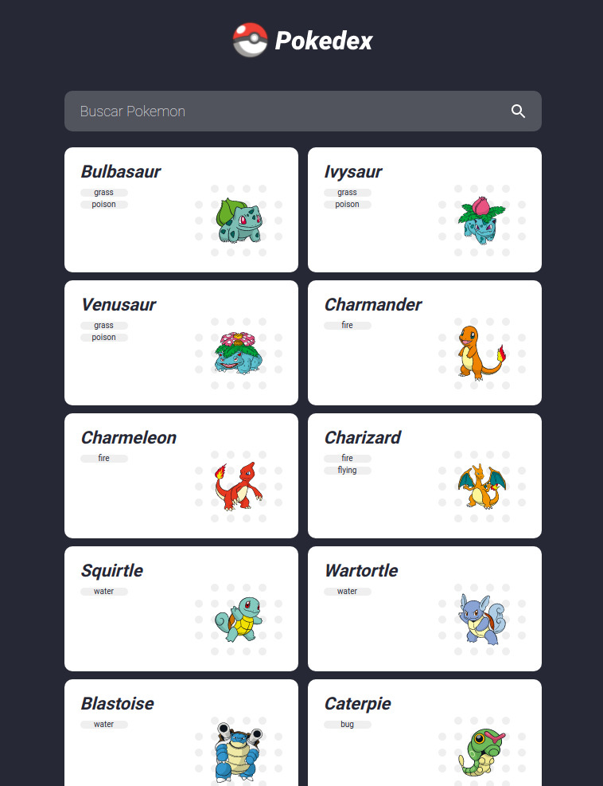

# Pokedex

This project was generated with [Angular CLI](https://github.com/angular/angular-cli) version 13.0.3.

## Pokémon

* [PokéApi](http://pokeapi.co/) - Images, names and informations.

* [Animation](https://www.theappguruz.com/tag-tools/web/CSSAnimations/) - Card animations

## Choose your Pokémon 

## I Choose you! 

## Gif

